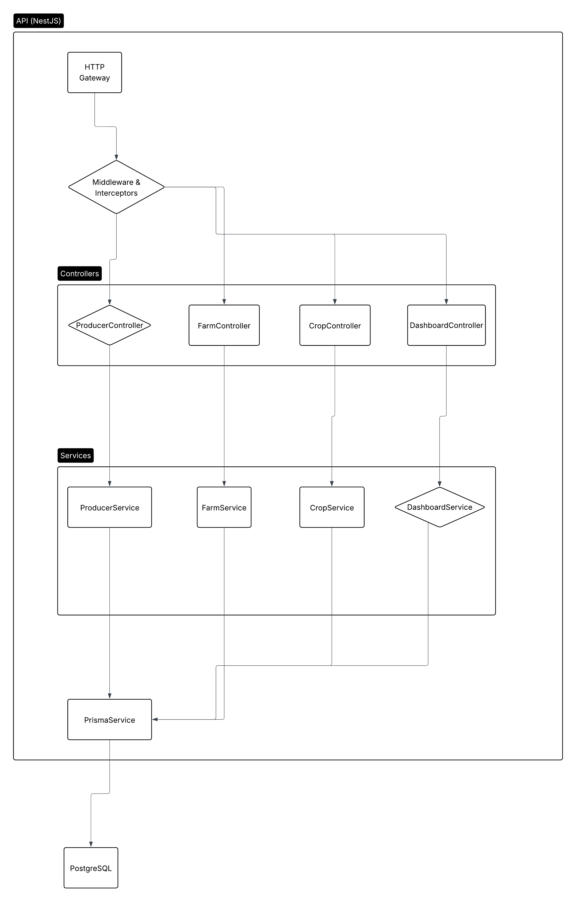

# 🌱 Rural API

API REST para gestão de produtores rurais, fazendas e culturas agrícolas.

---

## 🚀 Funcionalidades Implementadas

- **Cadastro, edição e exclusão de produtores rurais**
- **Validação de CPF/CNPJ** (unicidade e formato)
- **Cadastro, edição e exclusão de fazendas**
  - Validação: soma das áreas agricultável e de vegetação não pode ultrapassar a área total
- **Cadastro de culturas por fazenda e safra**
- **Relacionamentos:**
  - Um produtor pode ter várias fazendas
  - Uma fazenda pode ter várias culturas por safra
- **Dashboard** com:
  - Total de fazendas cadastradas
  - Total de hectares registrados
- **Documentação automática dos endpoints (Swagger)**
- **Testes unitários e de integração**
- **Logs de requisições e respostas**
- **Arquitetura em camadas seguindo boas práticas (SOLID, KISS, Clean Code)**

---

## 🐳 Como rodar com Docker

1. **Clone o repositório:**

   ```sh
   git clone <url-do-repo>
   cd rural-api
   ```

2. **Configure as variáveis de ambiente:**

   - Copie `.env.example` para `.env` e ajuste se necessário.

3. **Suba a aplicação e o banco de dados:**

   ```sh
   docker-compose up --build
   ```

4. **Acesse a API:**
   - Por padrão, estará disponível em: [http://localhost:3000](http://localhost:3000)

---

## 📚 Endpoints documentados via Swagger

- Acesse a documentação interativa em:  
  [http://localhost:3000/api](http://localhost:3000/api)

- Lá você encontra todos os endpoints, exemplos de requisição e resposta, e pode testar a API diretamente pelo navegador.

---

## 🧪 Como rodar os testes

1. **Com Docker (recomendado):**

   ```sh
   docker-compose exec app npm run test
   ```

2. **Localmente (fora do Docker):**
   ```sh
   npm install
   npm run test
   ```

- Os testes cobrem casos de sucesso, erro, validações e integrações entre módulos.

---

## 📈 Observabilidade (Logs)

- Todas as requisições e respostas são logadas via um interceptor global.
- Os logs incluem método HTTP, rota, status e tempo de resposta.
- Isso facilita o monitoramento, troubleshooting e auditoria do sistema.

---

## 🏛️ Arquitetura e Boas Práticas

- **Arquitetura em camadas:** Controllers, Services, DTOs, Modules
- **Princípios SOLID e Clean Code:** Separação de responsabilidades, código legível e testável
- **Validação de dados:** DTOs com decorators do `class-validator`
- **API Contracts:** Documentação OpenAPI/Swagger sempre atualizada
- **Testes:** Unitários e integrados, com dados mockados
- **Observabilidade:** Logs centralizados
- **Docker:** Facilita deploy e ambiente de desenvolvimento
- **ORM:** Prisma para integração com Postgres

---

## 📊 Diagramas e Fluxos

### 1. Diagrama de Camadas (Arquitetura)

.png>)

**Fluxo:**

- O cliente faz uma requisição HTTP para a API.
- O Controller recebe a requisição, valida os dados e encaminha para o Service.
- O Service executa as regras de negócio, validações adicionais e interage com o banco de dados via Prisma (ORM).
- O Prisma executa as operações no banco de dados Postgres.
- O Service retorna o resultado para o Controller, que envia a resposta ao Cliente.
- Interceptors (como o de logging) podem atuar em todas as etapas, registrando logs ou tratando exceções.

---

### 2. Diagrama de Componentes



**Fluxo:**

- Mostra a interação entre os principais módulos da aplicação (Controllers, Services, Prisma, Banco de Dados, etc).
- Cada componente é responsável por uma parte da lógica, garantindo separação de responsabilidades e fácil manutenção.

---

### 3. Diagrama de Sequência (Exemplo de Endpoint)

.png>)

**Fluxo:**

1. O usuário faz uma requisição para um endpoint (ex: criar produtor).
2. O Controller recebe e valida os dados.
3. O Service executa as regras de negócio e interage com o Prisma.
4. O Prisma realiza a operação no banco de dados.
5. O resultado retorna em cadeia até o usuário.

---

### 4. Diagrama de Entidades (Banco de Dados)

.png>)

**Fluxo:**

- Representa as tabelas do banco de dados (Produtor, Fazenda, Cultura, etc) e seus relacionamentos.
- Mostra como os dados estão organizados e conectados, garantindo integridade e eficiência nas operações.

---

> Os diagramas acima estão disponíveis na pasta `docs/diagrams` do projeto.

---

